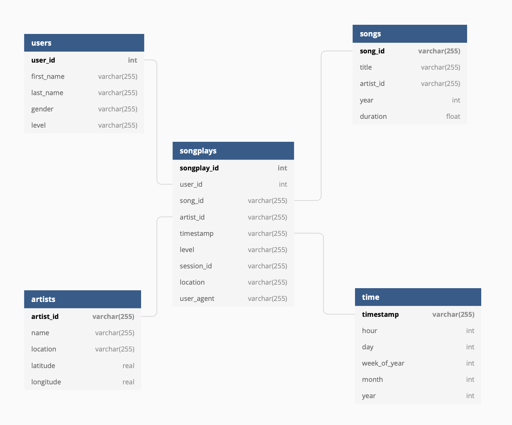

# About

This project contains two scripts as main components: one to define database tables and one to populate them using an ETL process. In addition, there is a Jupyter notebook that was used to prepare the basic steps that finally went in the ETL script.

# Purpose 

The database is used by the fictional startup Sparkify which offers a music streaming app.
The database is based on data about songs and users activities in this app. (Originally the
data is based on the [Million Song Dataset](https://labrosa.ee.columbia.edu/millionsong/).)

Since Sparkify wants to offer a great customer experience its team is interested in understanding how users interact with the app. Particular questions might be:

* What songs are users listing to?
* What songs are played most often?
* What songs are played rarely?
* Which users play the most songs?
* Which users play the fewest songs?
* Which browsers do users and which browsers are used more often?

All these questions lead to new questions or actionable insights which might help
to improve the user experience and business:

* Can we offer more songs like those users already like the most?
* Can we remove songs from the app that users rarely listen to reduce costs?
* What is characteristic about users which do not listen to too many songs?
* Why is the app not so popular for certain browser users? 
* Do we need to improve support for certain browsers? 
* Which browser is the most popular?

The last question might be relevant if we are interested in 
ensuring that we focus on having stable releases for this browser no matter what.

# Modeling 

The above questions indicate that it is useful to have records on how users interact with songs
with which browser at which time. These are the basic *facts* or *observations* recorded in the
data models central *fact table*. We can think of this fact table as an append-only log to which
we add a new row each time (recorded as the timestamp) a user (identified by its user id) plays a song (identified by its song id and the artist id).

More fine-grained information about such a song play event is then available
from the additional *dimension tables*. For instance, the table for the *dimension* artist
consists of rows giving for each unique artist id the name of the artist and the name its location as well as her geo location in form of latitude and longitude.  

The following diagram shows the described data model:
 


This diagram was created using the [dbdiagram tool](https://dbdiagram.io).

**Remark (choice of data type for the timestamp):** We store the timestamp as a string
and do not choose to use the timestamp type. It is expected that an
end-user would use the timetable to get the date and time information
from a given timestamp, or (in the other direction) would start from the time 
table if he wants to narrow down his query on the song plays table to a certain date-time range.

The timestamp is the number of ms since the Unix epoch. Therefore one might also
consider representing it as an integer. While it is true that this would allow
doing arithmetics this seems not to be the primary use case and it makes sense
to leave it to users if they want to parse the timestamp and do operations with it.
Instead, users might be interested in sorting or grouping song plays by timestamp
which is possible with the string representation. The lexicographical order on strings allows ordering timestamps by their corresponding time.

# Structure

The project is structured as follows:

```bash
.
├── README.md               # This file
├── create_tables.py        # Script for creating tables
├── data                    # Input data
│   ├── log_data            # Log data about user actions
│   └── song_data           # Data about songs and artists and songs
├── etl.ipynb               # Jupyter notebooks used for preparing the final ETL script
├── etl.py                  # ETL script
├── sql_queries.py          # SQL queries used by the table creation and etl script
└── test.ipynb              # Jupyter notebook used for testing the ETL pipeline
```

# Usage

First, create the tables and then ingest data to them using the ETL pipeline:

```
python3 create_tables.py
python3 etl.py
```

# Example queries and query results

Which songs are played most often?

```sql
SELECT 
  t.song_id,
  ss.title,
count 
FROM (
    SELECT 
    sps.song_id, 
    COUNT(*) AS count 
    FROM songplays AS sps
    LEFT JOIN songs AS ss ON sps.song_id = ss.song_id
    GROUP BY sps.song_id
    ORDER BY count
) t
LEFT JOIN songs ss ON t.song_id = ss.song_id;
```

Which top five users (by their id) have played the most songs?

```sql
SELECT 
  ss.user_id AS user_id,
  COUNT(*) AS count 
FROM songplays ss
GROUP BY ss.user_id
ORDER BY count DESC
LIMIT 5
```

From which location are most songs played? 

```sql 
SELECT 
  location, 
  COUNT(*) AS count 
FROM songplays 
GROUP BY location 
ORDER BY count DESC
```
 
What browser (more specifically [user client](https://en.wikipedia.org/wiki/User_agent)) is used most often by users?

```sql 
SELECT 
  user_agent, 
  COUNT(*) AS count 
FROM songplays 
GROUP BY user_agent 
ORDER BY count 
DESC LIMIT 5;
```

At which hour of the day were the most songs played?

```sql
SELECT 
  time.hour, 
  COUNT(*) AS count 
FROM songplays sps
JOIN time ON sps.timestamp = time.timestamp
GROUP BY time.hour 
ORDER BY count DESC 
```

For results see the notebook `queries.ipynb`.